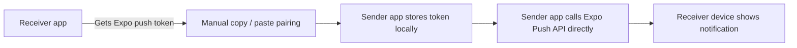

# Drink Water Pair Apps

Proof-of-work project, not polished product.

This repo shows a tiny two-phone reminder app for a personal notification workflow, built from one Expo/React Native codebase. One APK acts like a simple "send the nudge" button and the other APK acts like the receiver that owns notification permissions, exposes its Expo push token, and shows the reminder.

## What It Does

- Builds two Android app identities from one Expo/React Native codebase: a sender app and a receiver app.
- Uses manual token pairing instead of account systems, QR flows, or backend setup.
- Sends direct Expo push notifications from the sender app using the paired receiver token.
- Stores the paired token and send history locally on-device only.

## Why I Built It

I wanted a compact product/engineering artifact that shows decision-making, not just UI polish. The core idea was to make a deliberately small personal notification tool for a tightly scoped two-person workflow, then optimize for speed of implementation and clarity of interaction instead of building full user management or backend infrastructure.

## Features

- Dual app variants selected with `APP_VARIANT` / `EXPO_PUBLIC_APP_VARIANT`
- Two distinct Android APK identities from a shared codebase
- Receiver-side push permission handling and token retrieval
- Manual token copy/paste pairing flow
- Direct Expo Push API call from the sender app
- Local test notification on the receiver app
- Lightweight local-only send status and history tracking

## Tech Stack

- Expo
- React Native
- TypeScript
- Expo Notifications
- AsyncStorage
- Jest

## Architecture

The interesting constraint is that both app identities come from the same source tree. Variant metadata lives in `src/variant.ts`, `src/variantConfig.js`, and `app.config.js`, while the UI branches at runtime in [`App.tsx`](App.tsx).

## Interesting Technical Decisions

### Two APK identities from one codebase

The sender and receiver are intentionally separate app identities so each phone has a focused job. The codebase stays small because only the metadata and top-level screen switch vary between builds.

### Manual token pairing

Manual Expo token copy/paste is awkward at scale, but it is a rational tradeoff for a tiny trusted-device workflow. It avoids auth, contact graphs, QR coordination work, and backend storage while keeping the pairing model understandable.

### Direct Expo push notifications with no backend

For this scope, a backend would have added more operational surface area than product value. The sender app can call Expo's push endpoint directly because the use case only needs one paired token and no server-owned business logic.

### Local-only history

Send attempts and the paired token stay on-device in local storage. That keeps the artifact small and matches the fact that this was built as a personal tool rather than a synced multi-user product.

## Delivery Caveat

The sender app tracks whether Expo accepted the push request, which is useful for debugging the flow. That is not the same as proving the receiver device displayed the notification, so this repo should not be read as a delivery-guarantee system.

## Setup

1. Install dependencies with `npm install`.
2. Copy `.env.example` to `.env` if you want shell-managed env vars.
3. Set `EXPO_PROJECT_ID` for push token generation.
4. For the receiver build, add your own Firebase `google-services.json` file locally and point `GOOGLE_SERVICES_JSON_PATH` at it.
5. Start the sender app with `npm run android:sender`.
6. Start the receiver app with `npm run android:receiver`.

Useful build commands:

- `npm run prebuild:sender`
- `npm run prebuild:receiver`
- `npm run build:sender:apk`
- `npm run build:receiver:apk`

## Known Rough Edges

- Pairing is manual copy/paste, not user-friendly onboarding.
- Expo accepting a push request does not guarantee device receipt.
- The direct Expo push call is fine for a proof-of-work demo, but not ideal for a larger multi-user product.
- The public repo does not include Firebase service files or signing material.
- The Android native folder is intentionally not committed here; it is regenerated with Expo prebuild.

## Screenshots / GIF Placeholders

- `docs/media/sender-home.png`
- `docs/media/receiver-token.png`
- `docs/media/send-flow.gif`

## Public Repo Sanitization Notes

This public version removes private project identifiers, service files, build artifacts, and private-context copy. Safe placeholders are used where local/private setup previously existed.
